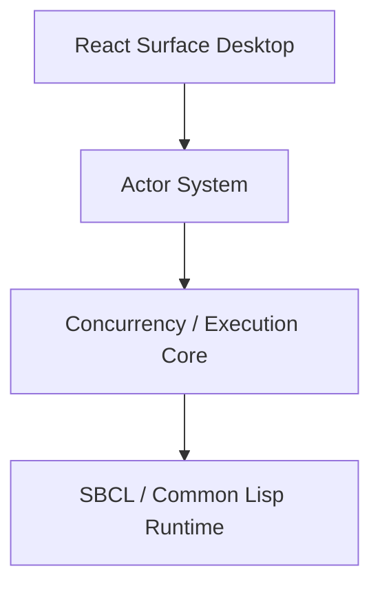

# sbcl-agent-ux

`sbcl-agent-ux` is the macOS desktop host for the governed execution environment implemented in `sbcl-agent`.

This repository does not begin with screens. It begins with the operating model that the desktop must faithfully express:

- the product is a persistent engineering environment, not a chat shell and not an IDE clone
- source truth, image truth, and workflow truth are distinct and must remain explicit
- governance is intrinsic to the system, not layered on after the fact
- the shell, REPL, conversation runtime, and desktop are presentation surfaces over the same governed service layer
- the desktop should increasingly act as a thin host over the shell desktop contract rather than inventing an independent application model
- the desktop must increasingly surface planning context, project authority, and environment posture as first-class operator context rather than treating them as hidden backend details

## Frontend Role

This repository defines the desktop host for the `sbcl-agent` repository.

That means the frontend must not invent a simpler product story than the one `sbcl-agent` already articulates and implements. Its job is to make the underlying actor runtime, concurrency/execution substrate, governance model, and operator surfaces legible, powerful, and governable for developers and engineers.

The desktop is therefore a presentation adapter over the `sbcl-agent` environment runtime and public execution services. It is not a separate application model.

That now includes a stronger context contract than the earlier desktop docs implied. The backend no longer ships only transcript and runtime summaries; it also ships:

- a canonical planning-context packet for provider-bound work
- durable `agent-constitution` and `capability-inventory` authority context
- canonical project authority and governed project records
- actor-system hierarchy, workflow edges, and supervision state
- environment-first summaries with active project, workflow, approval, incident, and capability posture

The primary target is the native macOS application `Surface` for developers and engineers. The shell remains a peer adapter, but this repository is now implementing a desktop host over the shell workspace, governance, object-browser, inspector, and desktop action model.

## Licensing

This repository is licensed under the [Apache License 2.0](LICENSES/APACHE-2.0.txt).

## The Shift It Must Accept

The desktop must start from the premise that software development is changing in a structural way.

`sbcl-agent` argues and increasingly implements a shift away from a purely source-first, file-proxy, after-the-fact reconstruction model toward an environment where:

- the live runtime is part of the engineering substrate
- humans and agents can inspect and mutate the same running system they are reasoning about
- workflow governance is captured during execution rather than reconstructed later
- conversation is durable and native, but not the only control surface
- evidence, approvals, incidents, reconciliation, execution handles, and execution surfaces are first-class engineering objects

The desktop succeeds only if it helps users operate inside that shift without collapsing back into older metaphors.

## Documentation Model

This repository separates documentation into two domains:

- [`docs/`](docs/index.md): user-facing GitHub Pages documentation for developers and engineers using Surface
- [`eng-docs/`](eng-docs/constitution.md): engineering documentation for designing, implementing, and extending the application itself

Use `docs/` when you want to understand how to operate the desktop product.

Use `eng-docs/` when you want architecture, specifications, delivery plans, implementation slices, or internal design rationale.

## Working Position

The desktop goal is not:

- "build a modern dashboard"
- "wrap the shell in a web app"
- "recreate SLIME/LispWorks in a browser"
- "make a chatbot for Lisp"

The desktop goal is:

- expose the environment as a first-class engineering substrate
- let developers and engineers reason across source, runtime, workflow, and governed execution in one coherent system
- make approvals, evidence, incidents, validation, reconciliation, and compatibility lifecycle legible instead of hidden
- preserve directness for expert operators while making the system more intelligible and navigable
- host the shell desktop contract faithfully rather than translating it into a separate product model

## Desktop Host Contract

The current desktop direction is to consume the shell-native desktop contract exposed by `sbcl-agent`, especially:

- `desktop/show`
- `desktop/action`
- `desktop/restore`

In practice the desktop also relies on the wider public service boundary for:

- environment summaries and status
- project lists and project detail
- thread, turn, and work-item detail
- actor-system panel and desktop-task orchestration views
- runtime, evidence, and incident context

That contract gives the desktop a stable model for:

- workspace surfaces
- governance queue posture
- object-browser groups
- inspector focus
- panel activation and selection
- restorable panel state

The Electron application should increasingly be a thin host over that model rather than a client that reconstructs navigation semantics from older command families.

## Architecture At A Glance

The older static PNG architecture set has been retired from the primary docs so the UX repo does not compete with the canonical architecture vocabulary in `sbcl-agent`.

The current stack is:



The planning and context path now matters as much as the execution path. `Surface` increasingly hosts a backend that already distinguishes:

- task frame
- authority state
- decisive evidence
- uncertainty and obligations
- strategy posture
- optional support context

The desktop does not yet expose every one of those packet sections as a named panel, but the UI is already built on the environment, project, conversation, execution, and orchestration surfaces that supply them.

The authoritative architecture references now live in the main `sbcl-agent` docs:

- [Architecture and Design](../sbcl-agent/docs/architecture.md)
- [Actor Runtime, Concurrency, And Governance](../sbcl-agent/docs/robust-actor-kernel-architecture.md)
- [Actor System Surface](../sbcl-agent/docs/actor-system-panel.md)
- [Conversation Runtime](../sbcl-agent/docs/conversation-architecture.md)

## Current Desktop Snapshot

The current `Surface` desktop is shown below. It illustrates the live multi-surface shell model: docked rails, floating workspace residents, the central stage, and the inspector remaining visible at the same time.


## Repository Structure

```text
sbcl-agent-ux/
├── LICENSE.md
├── README.md
├── docs/
│   ├── _config.yml
│   ├── index.md
│   ├── getting-started.md
│   ├── desktop-tour.md
│   ├── browser.md
│   ├── conversations.md
│   ├── execution.md
│   ├── recovery.md
│   ├── evidence.md
│   ├── configuration.md
│   ├── live-connection.md
│   ├── troubleshooting.md
│   └── faq.md
└── eng-docs/
    ├── constitution.md
    ├── requirements.md
    ├── capabilities.md
    ├── technical-architecture.md
    ├── design-system.md
    ├── desktop-ia.md
    ├── service-contracts.md
    ├── features/
    └── implementation-slices...
```

## How To Use This Repo

If you are evaluating or using the product:

1. Start at the [user documentation home](docs/index.md).
2. Read [Getting Started](docs/getting-started.md).
3. Take the [Desktop Tour](docs/desktop-tour.md).
4. Use the workspace guides for Browser, Conversations, Execution, Recovery, Evidence, and Configuration.
5. Use [Troubleshooting](docs/troubleshooting.md) and [FAQ](docs/faq.md) as needed.

If you are building or extending the product:

1. Start with the [engineering constitution](eng-docs/constitution.md).
2. Read [requirements](eng-docs/requirements.md), [capabilities](eng-docs/capabilities.md), and the [technical architecture](eng-docs/technical-architecture.md).
3. Continue into [design system](eng-docs/design-system.md), [desktop IA](eng-docs/desktop-ia.md), feature specs, and implementation slices.

That separation is intentional. User docs explain how to operate the desktop. Engineering docs explain how to design and implement it.

## Source Basis

These specs are derived from the current `sbcl-agent` architecture and documentation, especially:

- the environment-first framing
- the actor-runtime and execution-core transition
- the `invoke` / `inspect` / `control` boundary
- the conversation/runtime/workflow ownership rule
- the compatibility translation rule of preserving powers while discarding old metaphors
- the service event contract
- the governed mutation lifecycle
- the safety and risk model
- the emerging shell desktop host contract

## Next Step

The repository is now past pure specification and skeleton work.

The immediate implementation priorities are:

- keep the desktop host contract aligned with the evolving `sbcl-agent` shell model
- keep the desktop documentation aligned with the newer planning/context-engineering contract in `sbcl-agent`
- preserve shell parity while moving more UX behavior onto stable service-backed workspace surfaces
- keep the service tier distinct from direct shell execution paths while preserving the shell as a peer operator surface
- continue tightening documentation, naming, and metadata consistency across both repositories
- keep implementation passes aligned to the constitution, Surface guardrails, and feature specs
