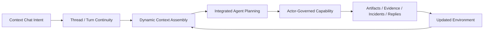

# Conversations

The Conversations workspace is for structured, durable conversation state.

It is not a simple transcript list.

The desktop treats conversations as governed runtime objects with:

- threads
- turns
- linked engineering entities
- durable continuation state
- selected-thread workspace persistence

The important architectural point is that conversation is not just transcript state. A conversation thread is one control surface over the same live environment that also contains runtime entities, workflow records, approvals, incidents, and evidence.

The backend also treats conversation planning context more explicitly than older docs implied. A conversation can carry not only transcript continuity but also:

- project-aware frame of reference
- linked runtime entities
- linked work-items and incidents
- governed continuation posture
- uncertainty that should block or shape the next step

## End-To-End Conversation, Planning, And Mutation Process

The conversation surface should be understood as the front door to a larger environment process.

When the system is working correctly, the path is:

1. a user submits an intent in Context Chat
2. the thread and turn establish continuity for that work
3. the backend gathers dynamic context from the environment:
   - runtime state
   - project targeting
   - workflow and approval posture
   - retrieval evidence
   - capability and provider readiness
4. the integrated agent plans within that context rather than from transcript alone
5. actor-governed execution routes the work into the appropriate capability path
6. code creation, code mutation, inspection, approvals, incidents, and artifacts are emitted back into the same environment
7. the next turn is then planned from the updated environment truth

That is why conversation here is not just chat. It is the conversational control surface for a self-hosted engineering loop.

## Why This Is Stronger Than Traditional External Agent Comparators

The usual external coding-agent model starts from files, shell output, and transcript, then tries to reconstruct the rest of the world from outside.

This system was designed to be more robust than that model:

- it does not depend only on file truth
- it uses the live runtime as part of context
- it carries workflow and governance state in the same environment
- it keeps incidents, approvals, artifacts, and evidence attached to the work itself
- it replans from updated environment truth after each meaningful action

So the advantage is not only that it can mutate code. The advantage is that code creation and mutation are only one part of a more complete engineering loop that includes context, governance, execution, and evidence inside one system.

## Threads

Use `Threads` when you want the broad conversation view.

The page starts with the thread table, then shows the selected thread below it:

- thread summary
- message history
- linked entities

Use this when you want to understand the larger supervised conversation.

The selected thread should remain stable while you inspect history and send the next message. If the thread changes, treat that as a bug rather than normal behavior.

## Turns

Use `Turns` when you want lifecycle detail on specific conversation turns.

The page starts with the turn table for the selected thread, then shows the selected turn below it:

- turn state
- associated operations
- artifacts
- approvals
- incidents
- work-items

Use this when you need to inspect a single conversation step as an engineering object.

## Draft

Use `Draft` when you want to prepare the next supervised conversation step.

The editor is the primary surface on this page. The selected thread context appears below it so the draft stays grounded in the current continuation.

Current draft behavior assumes:

- the selected thread remains active while you send
- transcript history stays visible after a send
- governed follow-up work can route from the same conversation context into approvals or work without losing thread orientation

## Recommended Workflow

1. pick the active thread
2. confirm the surrounding project or workflow context when the request is not self-evident
3. inspect the relevant turn if you need lifecycle detail
4. draft the next step only after you understand the linked context
5. move into Execution, Projects, or Evidence if the next action depends on direct runtime, governed project, or artifact inspection

## Important Distinction

Conversation is a native control surface, but it is not the entire application.

Use Browser, Execution, Recovery, and Evidence whenever the conversation needs direct runtime, workflow, or artifact context.
