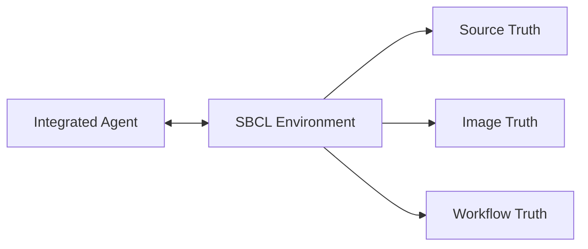
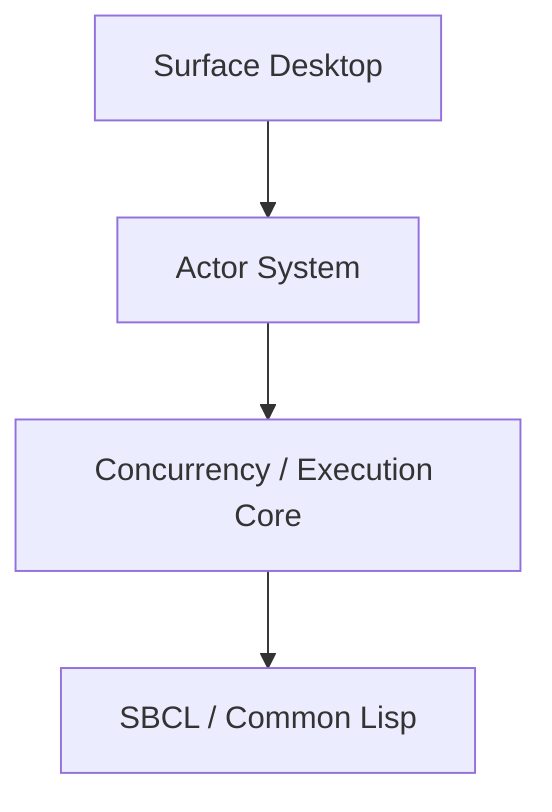
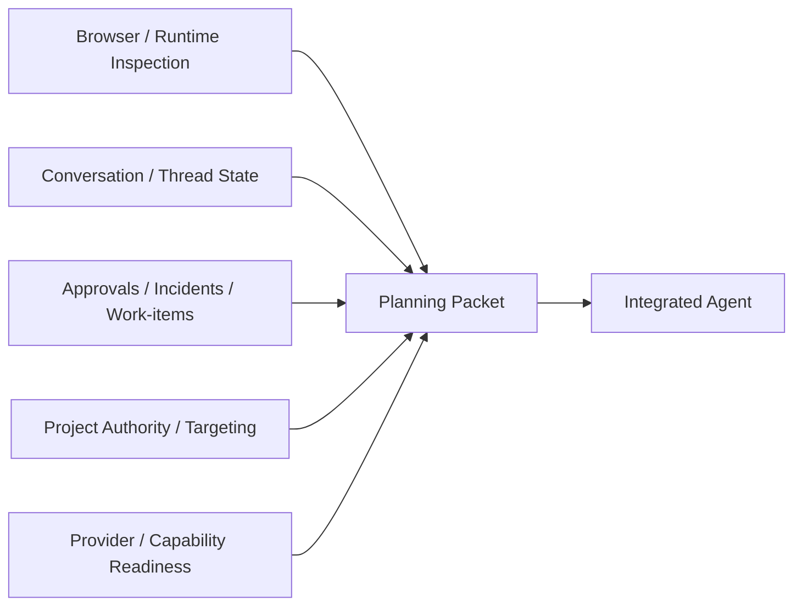
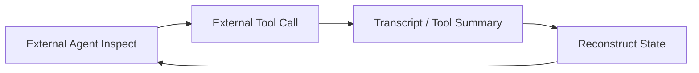
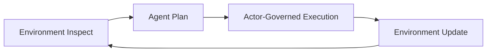
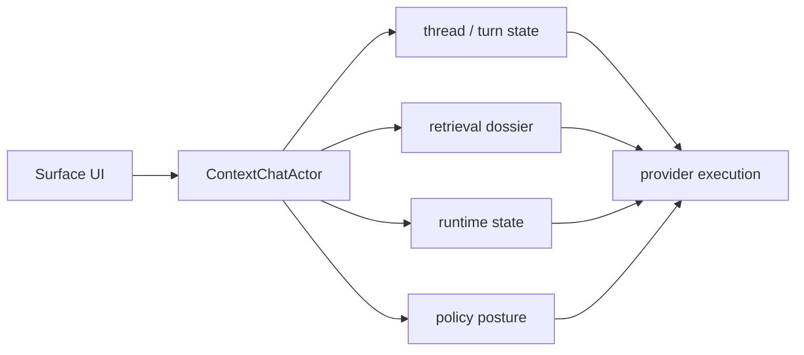
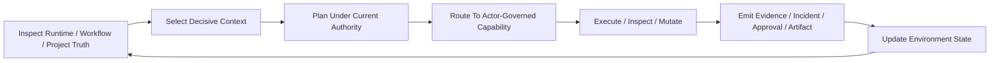
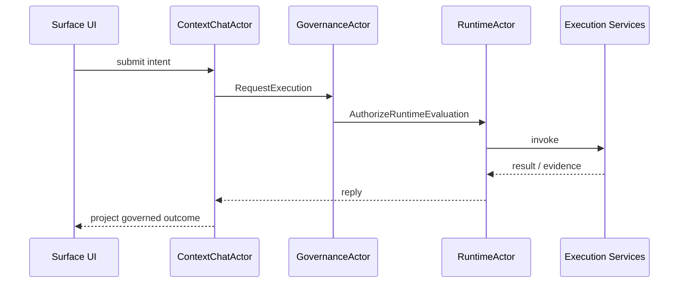

# How sbcl-agent Works

This page explains `sbcl-agent` as an operating model, not just as a user interface.

If you come from a conventional stack, you are probably used to separating:

- editor
- terminal
- runtime
- CI
- deployment tooling
- tickets
- incident tooling

`sbcl-agent` is built on a different assumption:

- these are not separate realities
- they are different views over one engineering environment

## The Root Object Is The Environment

In `sbcl-agent`, the environment is the thing you are actually working in.

That environment includes:

- the live SBCL image
- loaded ASDF systems and components
- packages, symbols, variables, classes, generic functions, and runtime objects
- structured agent and human conversations
- approvals, incidents, and work-items
- artifacts, evidence, and event history

This matters because modern engineering work is no longer just file manipulation.

Agents can inspect, evaluate, mutate, stage, and explain work across multiple layers. Once that becomes true, the user needs a system that keeps those layers aligned instead of scattering them across disconnected tools.

That alignment now includes planning context as well as execution context. The backend no longer builds provider-bound requests from transcript alone; it constructs a canonical planning packet that distinguishes:

- task frame
- authority state
- decisive evidence
- uncertainty and obligations
- strategy posture
- optional support

`Surface` does not expose that packet as a single raw object, but it increasingly presents the environment, project, conversation, execution, and orchestration surfaces that produce it.

The missing mental model in many agent systems is the feedback cycle. In `sbcl-agent`, the environment is not just a target and not just a telemetry source. It is an integrated part of the agent's live context:

- the environment supplies the runtime, workflow, governance, and evidence state the agent reasons from
- the agent itself operates inside that same environment
- the effects of the agent's work become new environment state
- the next planning/context packet is then built from that updated environment

That is why the environment has to be introspective and durable. The agent is not reasoning from an external shadow model. It is participating in the same system that it is reading and changing.

## Realtime Introspective Environment Architecture

The diagram below shows the architectural distinction that drives the whole system. `sbcl-agent` and `Surface` are not arranged like a traditional external agent supervising a target environment from the outside. The agent executes inside the same live SBCL environment that holds runtime state, transcript, memory, governance, evidence, and desktop state.

The important consequence is that this is a closed feedback loop:

1. the environment exposes live state
2. that live state becomes agent context
3. the agent acts from inside the environment
4. those actions create new environment state
5. the next turn is planned from that updated environment

## Execution And Actor Architecture

At the center of that environment is a shared execution substrate plus an actor runtime: `invoke`, `inspect`, and `control` govern how runtime work happens, while the actor system owns message-driven workflow continuity and governance-aware execution.

Actors should be understood here as internal tools of the environment, not just as an implementation detail behind UI panels.

That distinction matters. `sbcl-agent` can still talk to MCP servers and other external integrations, but the main operating model is not "UI calls MCP directly." The stronger model is:

- the environment exposes governed capabilities
- actors own continuity, message flow, and supervision
- the shared execution substrate runs the work
- MCP remains an integration boundary, not the main internal control plane

This is more scalable because the system can grow by adding actor identities, queues, pooled workers, and governed workflows without making the desktop transcript or frontend state responsible for continuity.

## How Context Is Produced

The desktop should be understood as a projection of a larger context-production pipeline.

That pipeline pulls from several environment dimensions at once:

- source state
- runtime/image state
- workflow and conversation state
- governance and approval posture
- project targeting and project authority
- evidence, incidents, and validation outcomes
- capability and provider-route readiness

Those inputs are then narrowed into a planning packet that the integrated agent consumes. The desktop surfaces only pieces of that packet directly, but it increasingly exposes the domains that produce it.

This is why the desktop is better understood as a projection of context production rather than just a collection of disconnected workspaces.

## Why This Loop Is Harder To Reproduce With An Externalized Agent

An external coding agent usually has to reconstruct reality from outside:

- repo snapshot
- shell output
- tool responses
- service calls
- ticket or chat context

That can work, but it is inherently lossy. The agent is outside the system and has to rebuild state across boundaries between calls.

`sbcl-agent` is tighter because:

- the environment is the source of context
- the agent is part of that environment
- actions create new environment state
- that new state is immediately available for the next planning step

The result is a shorter development loop:

1. inspect live environment truth
2. act inside that same environment
3. observe the new runtime/workflow/evidence state
4. plan the next step from that updated truth

That is difficult to reproduce fully with an externalized agent, because the external agent does not naturally own the runtime, the workflow record, the approvals, and the evidence trail as one integrated environment.

One way to explain this shift is through the old move from markup-driven word processing to WYSIWYG word processing.

In the older model, you edit markup, run a formatter, and then inspect the rendered result. A lot of traditional software engineering and external coding-agent work still feels like that:

- edit files
- run tools
- read logs and outputs
- reconstruct what the system now is

`sbcl-agent` aims for the WYSIWYG analogue for software engineering and agentic development:

- inspect the live environment directly
- act inside that same environment
- see the updated runtime, workflow, and evidence state immediately
- continue from the new truth without leaving the environment

The claim is not that source files stop mattering. The claim is that the engineering loop becomes much more direct when source, runtime, workflow, and agent activity are different views over one live system rather than disconnected artifacts that have to be reconciled after the fact.

By contrast, the self-hosted `sbcl-agent` loop is:

## The System Keeps Three Realities Together

`sbcl-agent` tries to keep three realities in view at the same time:

1. source reality
2. runtime reality
3. workflow reality

### Source Reality

Source reality includes:

- files
- forms
- definitions
- documentation
- durable edits

### Runtime Reality

Runtime reality includes:

- what is currently loaded
- what symbols are visible
- what objects exist now
- what values, methods, and dispatch behavior exist now
- what direct evaluation does now

### Workflow Reality

Workflow reality includes:

- what thread is carrying the work
- what turn produced which action
- what approvals are waiting
- what incidents were raised
- what artifacts and evidence exist
- whether the work is actually complete

In a conventional SDLC, developers often move through these realities one at a time and reconstruct the links manually. `sbcl-agent` is designed to preserve those links as first-class system state.

## The Basic Operating Loop

A typical `sbcl-agent` loop looks like this:

1. inspect the current environment
2. identify the relevant runtime or source entity
3. continue or open the relevant conversation thread when coordination is needed
4. evaluate, inspect, or mutate through a governed operation
5. review approvals, incidents, or work-items created by that action
6. inspect evidence before closing the work

That is different from:

1. edit files
2. run a build
3. deploy somewhere
4. search through logs to understand what happened

The difference is not cosmetic. It changes where engineering truth lives and how quickly humans and agents can converge on that truth.

## Conversations Are Not Just Chat

A common mistake is to assume the agent layer is simply a transcript UI.

In `sbcl-agent`, conversations are structured engineering continuations.

Threads and turns can carry:

- linked runtime entities
- operations
- artifacts
- approvals
- incidents
- work-items

That means a conversation is not just "discussion about the work." It can be part of the durable record of how the work was inspected, changed, governed, and resolved.

The backend also now supports explicit project-aware conversation framing. Context Chat can be anchored to zero, one, or many projects, and project ambiguity can be promoted into planning uncertainty instead of being silently ignored. The desktop already benefits from that richer project-aware backend contract even where the UX is still evolving.

## Conversational Context Architecture

The conversation layer does not send only the current prompt to the model. It assembles live context from the Surface desktop, the SBCL environment, transcript history, and deliberate operator memory before a turn is executed.

What is important in the current implementation is that the conversation layer is not doing naive prompt stuffing. It is using the dynamic context pipeline described in the backend docs:

- gather environment and conversation truth
- gather project and governance posture
- retrieve broadly
- select decisively
- preserve uncertainty
- then route execution

That means the conversation surface is increasingly a view over context production and context consumption, not just a message log.

## Planning Workflow And Iterative Loop

The planning workflow agent implementation is best understood as this loop:

This is the practical form of the self-hosted introspective process. The environment is continuously re-materialized as the next planning surface.

## The Browser Is A Live Image Browser

The Browser workspace is intentionally close to the classic Lisp notion of a system browser.

It is where you inspect:

- systems
- packages
- symbols
- variables
- classes and methods
- runtime objects
- source
- xref
- documentation

This is one of the largest conceptual shifts for developers coming from file-first tooling. You do not begin from a directory tree because the system wants you to inspect what the environment actually is before assuming what the files probably mean.

## Projects Are Now First-Class

The environment is not only runtime-aware. It is also project-aware.

Governed projects can now carry:

- constitutions
- requirements
- feature specifications
- architecture decisions
- testing strategy
- quality gates
- release readiness
- readiness obligations
- linked work-items and incidents

This matters because planning and execution are now grounded not only in environment posture but also in project authority and project readiness.

## The Listener Remains Central

Common Lisp development is still deeply interactive.

`sbcl-agent` does not remove the REPL model. It extends it.

The listener remains the direct control surface for:

- evaluation
- immediate inspection
- runtime reasoning
- rapid correction

What changes is that the consequences of those actions can remain attached to:

- approvals
- artifacts
- incidents
- work-items
- structured turns

This is why the desktop should not be understood as "chat plus a browser." It is a governed interactive engineering shell.

## Governance Is Inside The Workflow

Traditional workflows often keep governance outside the engineering surface.

Examples:

- approval in a ticket
- audit in CI
- failure notes in incident tooling
- evidence in logs or attachments

`sbcl-agent` tries to keep governance inside the operating flow itself.

That is why approvals, incidents, reconciliation, and evidence are visible as native objects instead of hidden implementation details.

The goal is not bureaucracy. The goal is continuity:

- what was requested
- why it was allowed or blocked
- what happened
- what still needs closure

## Governance Architecture

Governance is part of the operating environment itself. Runtime actions, approvals, work-items, incidents, evidence, and recovery form one continuous loop rather than being split across unrelated external systems.

The important change is that governance is no longer best understood as a separate kernel-era control plane. It is now part of actor execution and effect handling inside the same self-hosted environment runtime.

The canonical architecture pages now live in the main repository docs:

- [`sbcl-agent` architecture](../../sbcl-agent/docs/architecture.md)
- [`sbcl-agent` actor runtime](../../sbcl-agent/docs/robust-actor-kernel-architecture.md)
- [`sbcl-agent` actor system surface](../../sbcl-agent/docs/actor-system-panel.md)

## Why This Matters For Agentic Development

As agent capability increases, the weak point in software development is no longer just code generation speed.

The weak points become:

- context fragmentation
- poor runtime visibility
- weak linkage between action and consequence
- weak governance continuity
- expensive post-hoc reconstruction

`sbcl-agent` is built for a world where agents can act, not just suggest.

Once agents can act, the engineering system has to preserve trust, inspectability, and closure. That is the purpose of the broader environment model.

## What Gets Better

When this model is working well, developers should get:

- faster understanding of the current environment
- less confusion about what is loaded and active
- tighter linkage between runtime and source
- durable engineering context instead of disposable transcripts
- clearer approval and recovery posture
- better evidence for what actually happened

## What You Still Keep From Traditional Development

This model does not reject:

- source control
- testing
- builds
- release management
- deployment

It changes their position in the workflow.

They are no longer the only places where engineering truth becomes visible.

## The Main Transition To Accept

The main transition is this:

You are no longer primarily editing text that later becomes a system.

You are operating inside a live engineering system where source, runtime, agent coordination, governance, and evidence are all part of the same working environment.
